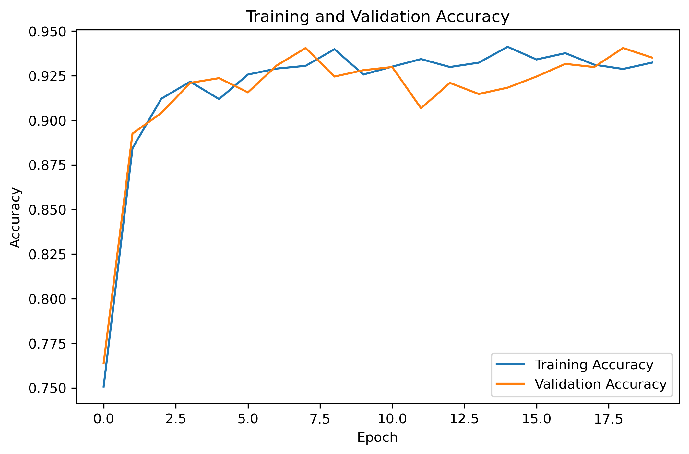
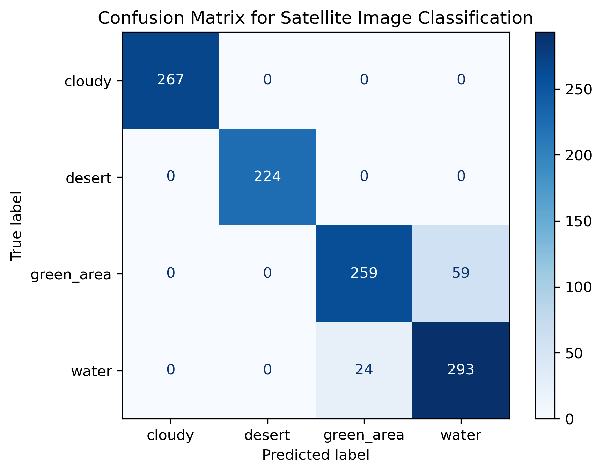

# Satellite Image Classification Using Convolutional Neural Networks (CNNs)

## Overview

This project uses deep learning and computer vision techniques to classify satellite imagery into four environmental land-cover categories:

* Cloudy
* Desert
* Green Area
* Water

The project was developed in Python using TensorFlow/Keras within a Jupyter Notebook environment. A convolutional neural network (CNN) was trained to identify visual patterns in satellite imagery and classify images into their corresponding environmental category.

The project demonstrates the complete workflow for an image classification task, including:

* image preprocessing
* dataset visualization
* CNN model development
* model evaluation
* data augmentation
* retraining and performance improvement
* prediction testing
* saving trained models and visualizations

---

## Objectives

The goals of this project were to:

* Build a multi-class image classification model using satellite imagery
* Explore deep learning workflows using TensorFlow/Keras
* Evaluate model performance using accuracy metrics and confusion matrices
* Improve model generalization through data augmentation
* Demonstrate iterative model refinement and retraining
* Create a portfolio-ready computer vision project

---

## Dataset

The dataset consists of labeled satellite images organized into four classes:

* `cloudy`
* `desert`
* `green_area`
* `water`

The dataset was obtained from Kaggle and stored locally in separate folders for each image category.

Example dataset structure:

```text
Satelite image data/
│
├── cloudy/
├── desert/
├── green_area/
└── water/
```

Due to dataset size limitations, raw image files are not included in this repository.

---

## Technologies Used

* Python
* TensorFlow / Keras
* NumPy
* Matplotlib
* Scikit-learn
* Jupyter Notebook

---

## Project Workflow

### 1. Data Loading and Exploration

The dataset was loaded using TensorFlow's `image_dataset_from_directory()` function. Images were automatically labeled based on folder names and resized for CNN training.

### 2. Data Visualization

Sample satellite images from each class were visualized to better understand environmental differences and image characteristics.

### 3. CNN Model Development

A convolutional neural network was built using:

* convolutional layers
* max pooling layers
* dense layers
* dropout regularization

The model used softmax activation for multi-class classification.

### 4. Initial Model Evaluation

The initial model achieved moderate performance but showed classification uncertainty between visually similar environmental categories.

One test image from the water class was incorrectly classified as a green area with approximately 50% confidence.

### 5. Data Augmentation and Retraining

To improve generalization and reduce overfitting, data augmentation techniques were introduced:

* random horizontal flipping
* random rotation
* random zoom

The model was retrained for additional epochs using the augmented dataset.

### 6. Improved Prediction Performance

After retraining, the same water image was correctly classified as water with improved confidence.

This demonstrated how augmentation and iterative retraining can improve CNN performance on real-world image classification tasks.

---

## Model Architecture

The CNN architecture included:

* Image rescaling layer
* Data augmentation layer
* 3 convolutional layers
* Max pooling layers
* Dense hidden layer
* Dropout layer
* Softmax output layer

---

## Results

### Validation Metrics

The retrained CNN demonstrated improved classification performance compared to the original baseline model.

### Original vs. Retrained Prediction

| Model Version                   | Predicted Class | Confidence | Correct? |
| ------------------------------- | --------------- | ---------- | -------- |
| Original CNN                    | green_area      | 50%        | No       |
| Retrained CNN with Augmentation | water           | 57.77%     | Yes      |

### Accuracy Plot



### Loss Plot


### Confusion Matrix



---

## Key Takeaways

This project demonstrates several important machine learning and computer vision concepts:

* Deep learning image classification workflows
* CNN architecture design
* Model evaluation and interpretation
* Data augmentation techniques
* Iterative model improvement
* Understanding confidence scores in predictions
* Handling visually similar image classes

The project also highlights how environmental imagery can contain overlapping visual characteristics, making classification tasks more challenging.

---

## Future Improvements

Potential future improvements include:

* Transfer learning using pretrained models such as MobileNetV2 or ResNet50
* Hyperparameter tuning
* Larger and more diverse datasets
* Additional image augmentation strategies
* Model deployment using Flask
* Building an interactive prediction web application

---

## Repository Structure

```text
satellite-image-classification/
│
├── data/
│   └── README.md
│
├── figures/
│   ├── accuracy_plot.png
│   ├── loss_plot.png
│   └── confusion_matrix.png
│
├── models/
│   └── satellite_cnn_augmented_model.keras
│
├── notebooks/
│   └── satellite_image_classification.ipynb
│
├── requirements.txt
└── README.md
```
